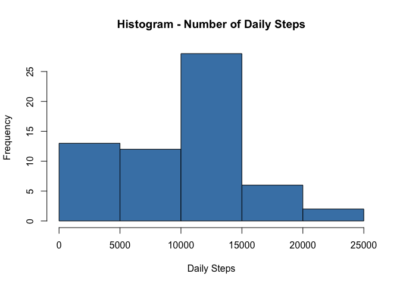
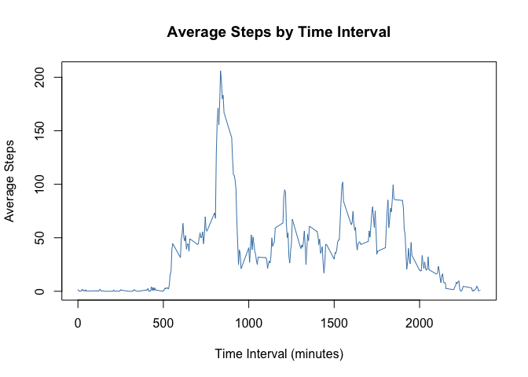
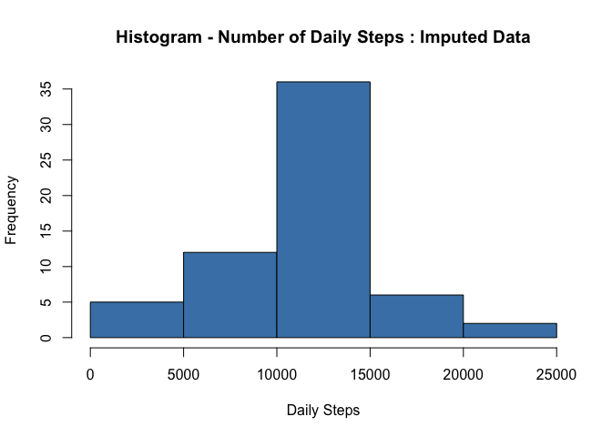
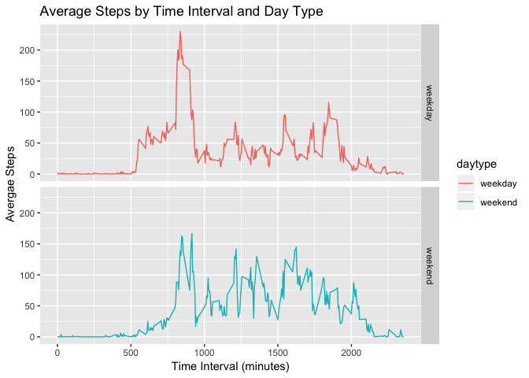

## Loading and preprocessing the data

First step is to read the *activity.csv* file located in the provided *activity.zip* file.  We know from the instrctions that missing values are coded as 'NA' so we will address this during the load.  The results be loaded into the *stepdata* dataframe.  


```r
stepdata <- read.csv(unz('activity.zip', 'activity.csv'), header=TRUE, na.strings = 'NA', stringsAsFactors = F)
```


Next step is to convert the date variable to an actual date format, then verify the structure of the *stepdata* dataframe


```r
stepdata$date<-as.Date(as.character(stepdata$date), '%Y-%m-%d')
str(stepdata)
```

```
## 'data.frame':	17568 obs. of  3 variables:
##  $ steps   : int  NA NA NA NA NA NA NA NA NA NA ...
##  $ date    : Date, format: "2012-10-01" "2012-10-01" ...
##  $ interval: int  0 5 10 15 20 25 30 35 40 45 ...
```
## What is mean total number of steps taken per day?
For this part of the assignment, you can ignore the missing values in the dataset.

1.  Calculate the total number of steps taken per day

We will do this with the aggregate function and store in a variable *stepdata.sumday*


```r
stepdata.sumday <- aggregate(list(steps=stepdata$steps), list(date=stepdata$date), sum, na.rm=T)
```
2.  Make a histogram of the total number of steps taken each day

```r
hist(stepdata.sumday$steps, col='steelblue', xlab='Daily Steps', main='Histogram - Number of Daily Steps')
```

<!-- -->

3.  Calculate and report the mean and median of the total number of steps taken per day

```r
 summary(stepdata.sumday$steps)
```

```
##    Min. 1st Qu.  Median    Mean 3rd Qu.    Max. 
##       0    6778   10395    9354   12811   21194
```


## What is the average daily activity pattern?

1.  Make a time series plot (i.e. type="l") of the 5-minute interval (x-axis) and the average number of steps taken, averaged across all days (y-axis)

First aggregate steps by averaging over the intervals, again ignoring the missing values.  Store in variable *stepdata.avgint*.  Then plot the data.

```r
stepdata.avgint <- aggregate(list(steps=stepdata$steps), list(interval=stepdata$interval), mean, na.rm=T)

with(stepdata.avgint, plot(interval, steps, type='l', col='steelblue', main='Average Steps by Time Interval', ylab='Average Steps', xlab='Time Interval (minutes)'))
```

<!-- -->

2.  Which 5-minute interval, on average across all the days in the dataset, contains the maximum number of steps?


```r
stepdata.avgint[which.max(stepdata.avgint$steps),]$interval
```

```
## [1] 835
```
The five minute interval with the most steps happens at 835.

## Imputing missing values

1.  Calculate and report the total number of missing values in the dataset (i.e. the total number of rows with NAs)

Calculate by subtracting the total number of rows in *stepdata* minus the total number of complete cases.

```r
nrow(stepdata)-nrow(na.omit(stepdata))
```

```
## [1] 2304
```

Out of 17568 rows of data, the total number of rows which have at least one NA value is 2304 rows.

2.  Devise a strategy for filling in all of the missing values in the dataset. 

The approach will be to use the average steps per interval calculated above in the variable *stepdata.avgint*

3.  Create a new dataset that is equal to the original dataset but with the missing data filled in.

First we need to create a dataframe consisting of the missing values only.  Next, we need to jooin the missing intervals with the average intervals in the *stepdata.avgint* dataframe created above.  Convert the steps to integers to provide more realistic data. Finally, we can combine it with all of the non-missing values from the *stepdata* dataframe


```r
## subset the missing data and join with the average values
stepdata.imputed <- stepdata[!complete.cases(stepdata),2:3] %>% inner_join(stepdata.avgint, by='interval')
## convert new steps to integers
stepdata.imputed$steps<-as.integer(stepdata.imputed$steps)
## merge the imputed rowa with the non-missing rows
stepdata.imputed <-rbind(stepdata.imputed, stepdata[complete.cases(stepdata),])
```


4.  Make a histogram of the total number of steps taken each day and Calculate and report the mean and median total number of steps taken per day. Do these values differ from the estimates from the first part of the assignment? What is the impact of imputing missing data on the estimates of the total daily number of steps?

For the histogram, recreate the aggregate of the daily steps.


```r
stepdata.imputed.sumday <- aggregate(list(steps=stepdata.imputed$steps), list(date=stepdata.imputed$date), sum)

hist(stepdata.imputed.sumday$steps, col='steelblue', xlab='Daily Steps', main='Histogram - Number of Daily Steps : Imputed Data')
```

<!-- -->


The mean and median for the imputed data followed by the missing data set.


```r
summary(stepdata.imputed.sumday$steps)
```

```
##    Min. 1st Qu.  Median    Mean 3rd Qu.    Max. 
##      41    9819   10641   10750   12811   21194
```


The mean has increased by 1395 or 15% while the median has increased by 246 or 13%.  The impact of using this imputing strategy is that it will increase both the mean and median versus removing the missing data.

## Are there differences in activity patterns between weekdays and weekends?

1.  Create a new factor variable in the dataset with two levels – “weekday” and “weekend” indicating whether a given date is a weekday or weekend day.


```r
stepdata.imputed$daytype <- as.factor(ifelse(weekdays(stepdata.imputed$date)=='Saturday'|weekdays(stepdata.imputed$date)=='Sunday','weekend','weekday'))
```

2.  Make a panel plot containing a time series plot (i.e. type="l") of the 5-minute interval (x-axis) and the average number of steps taken, averaged across all weekday days or weekend days (y-axis). See the README file in the GitHub repository to see an example of what this plot should look like using simulated data.


```r
stepdata.imputed.avgday <- aggregate(list(steps=stepdata.imputed$steps), list(interval=stepdata.imputed$interval, daytype=stepdata.imputed$daytype), mean)
qplot(interval, steps, data= stepdata.imputed.avgday, aes(col=daytype), geom='line', facets = daytype~., main='Average Steps by Time Interval and Day Type', ylab='Avergae Steps', xlab='Time Interval (minutes)')
```

<!-- -->

Yes there are differences in patterns between weekdays and weekends.  Weekdays seem to have most of their activity between 500 and 1900 minutes, with a defined spike between 750 and 100 minutes.  The weekends have more of their activities from 750 to 2100 minutes.  There is still a spike between 750-100 but it is much lest pronounced.  This data would indicate a more active start to weekdays, followed by more sedintery period for the rest of the day, where as a weekend has a more evenly distributed amount of activity.  This could be due to the a more regimented schedule during the week as opposed to the weekend.


 
